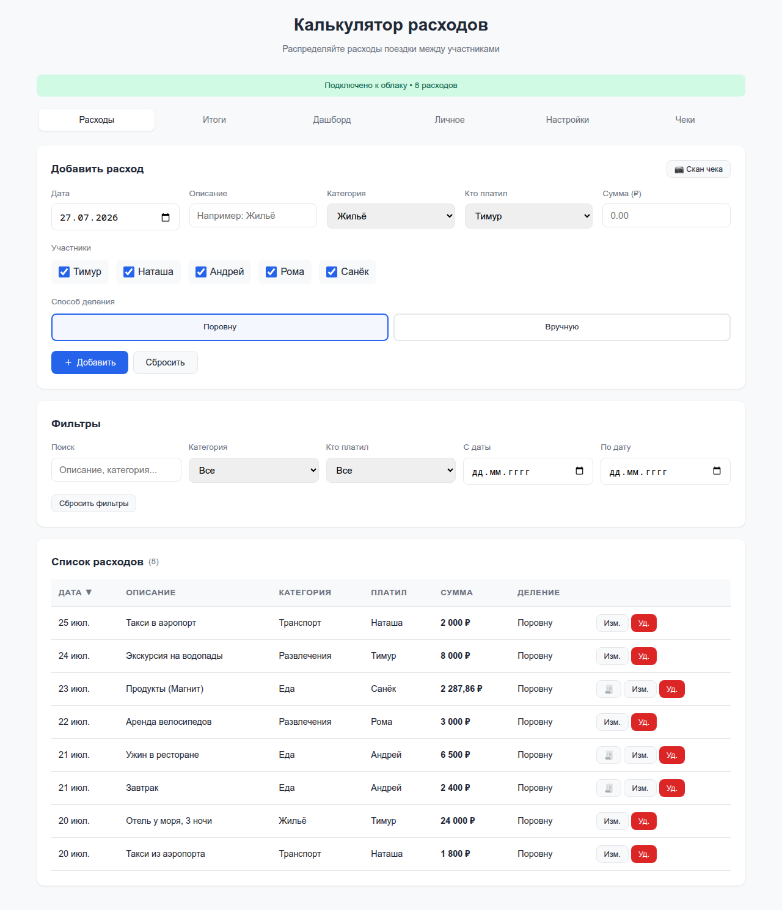
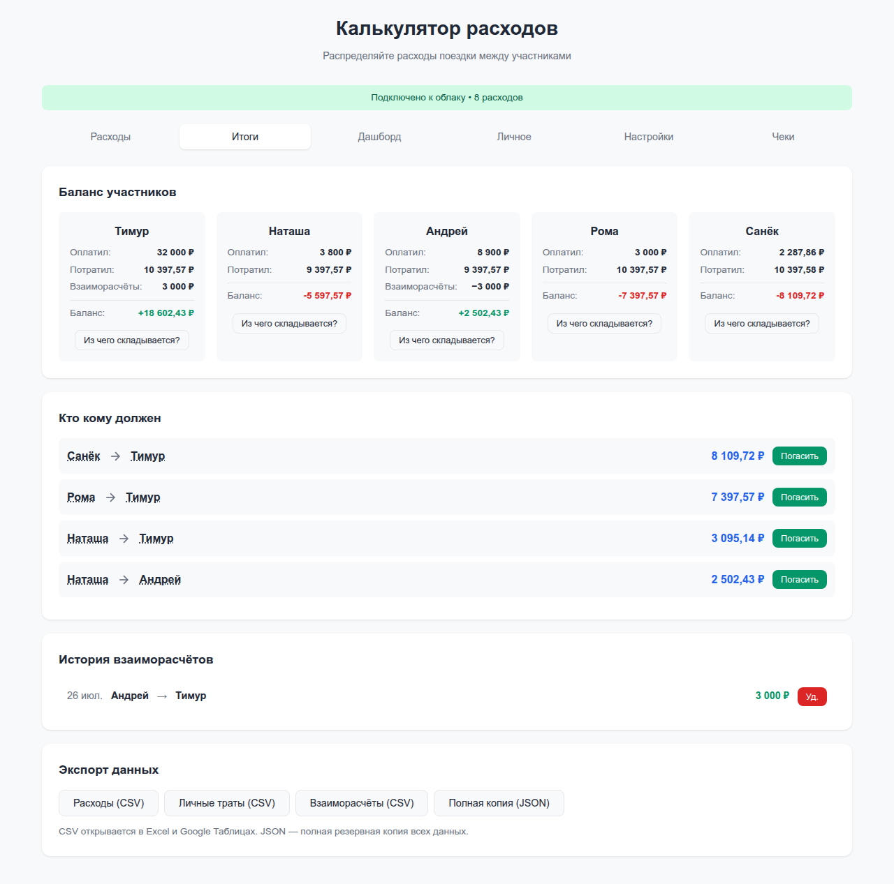
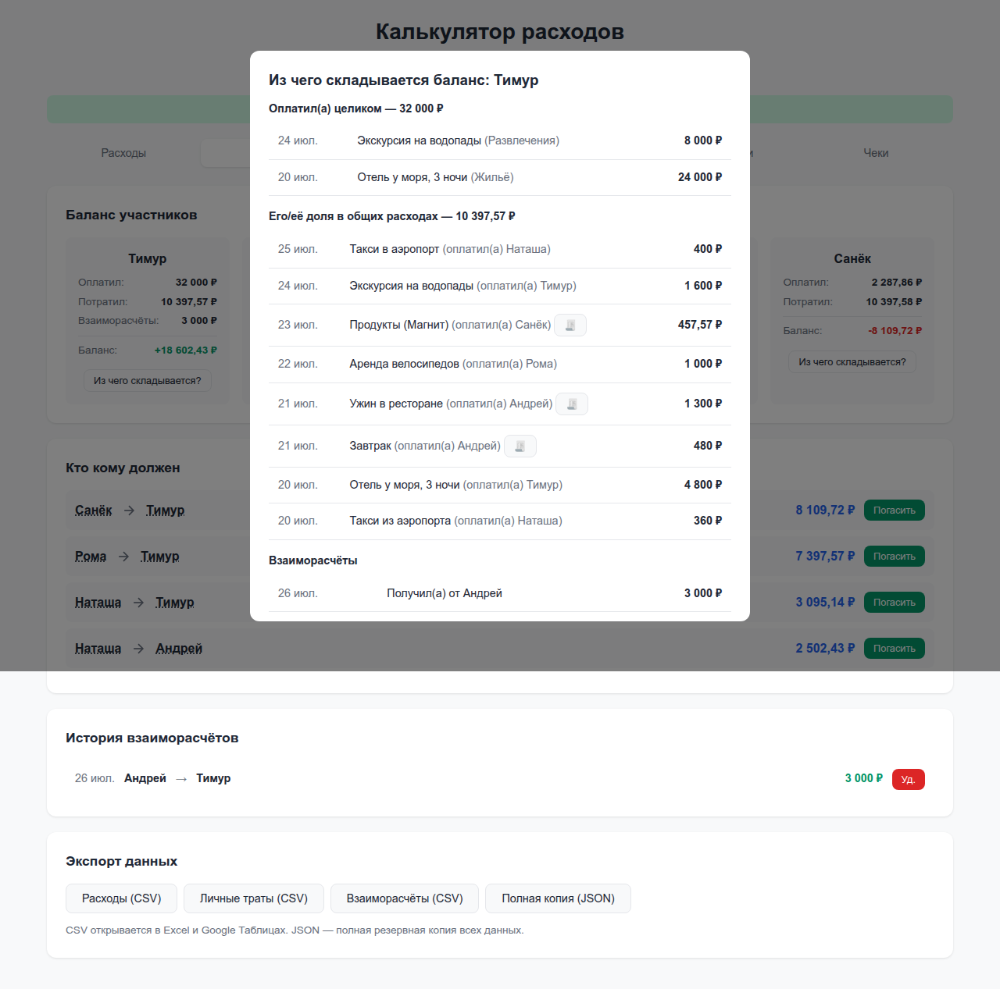
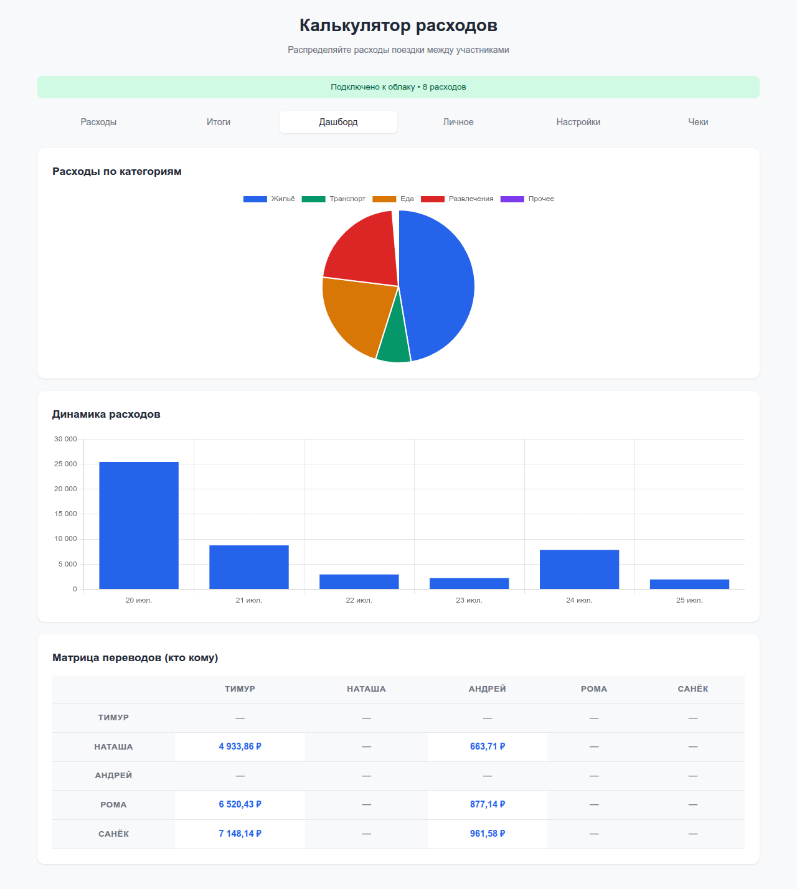
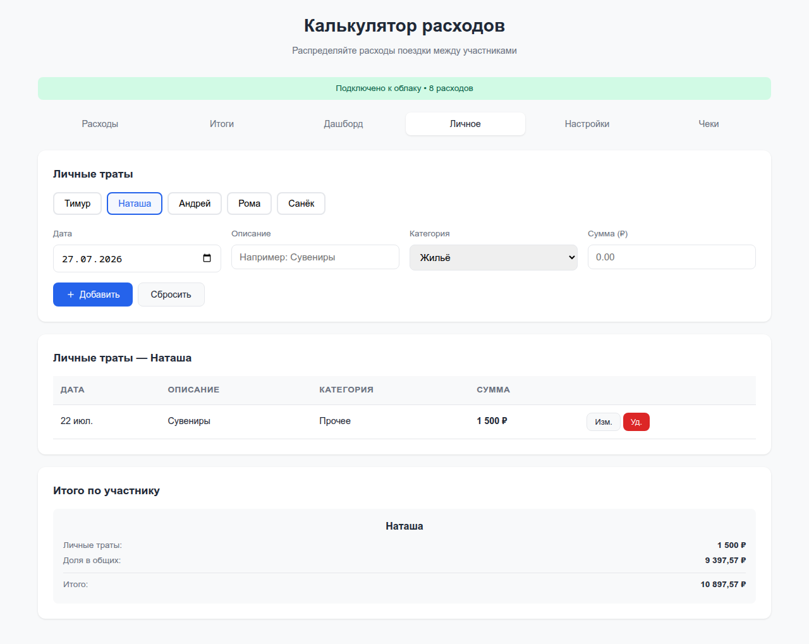
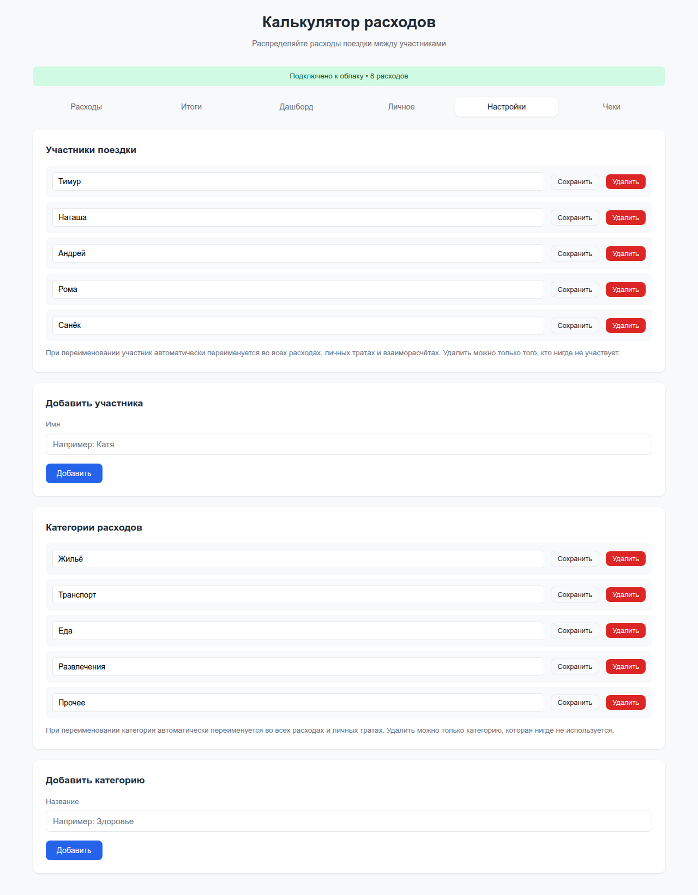
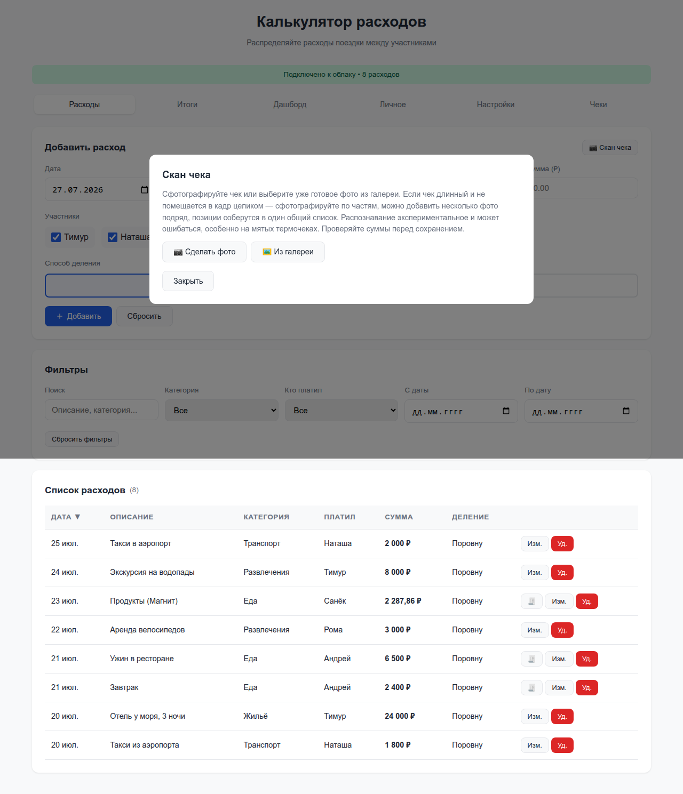
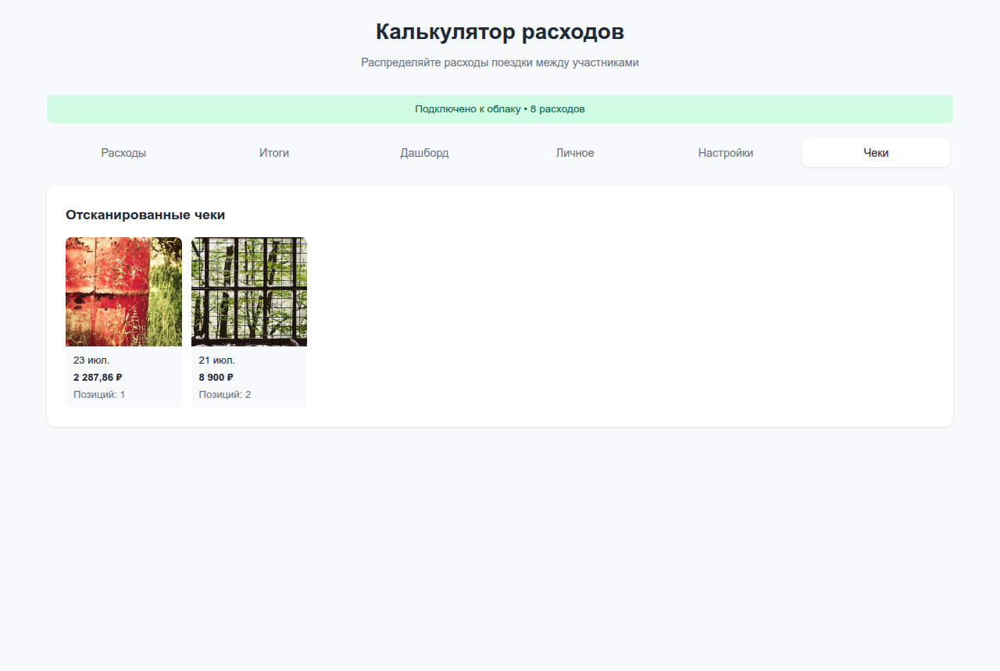

# Калькулятор расходов в поездке

Веб-приложение для распределения расходов поездки между участниками.

## Зачем это нужно

Когда компания едет в поездку, расходы обычно записывают в общий чат или
табличку в Google Sheets, которую через день перестают вести. В конце
поездки никто не помнит, кто и сколько платил, а разобраться, кто кому
должен, приходится вручную и на нервах. Этот калькулятор решает именно это:

- **Считает долги сам** — не «все скинулись всем», а минимальное число
  переводов, которое закрывает баланс между всеми участниками.
- **Прозрачность вместо «доверься мне»** — по каждому балансу видно, из
  каких конкретно расходов он сложился, а расход можно подтвердить фото
  чека.
- **Не надо вести вручную** — сфотографировал чек, отметил галочками, кто
  участвует в каждой позиции — суммы посчитаются и разобьются сами.
- **Работает у всех сразу** — расход, добавленный одним участником,
  мгновенно появляется у всех остальных, даже если кто-то в этот момент
  без интернета — досинхронизируется, как только сеть появится.
- **Бесплатно и без установки** — сайт на GitHub Pages, база на бесплатном
  тарифе Supabase, ничего скачивать не нужно, открывается в браузере
  телефона как обычное приложение.

## Скриншоты

Расходы: список, фильтры, форма добавления с кнопкой скана чека.



Итоги: баланс каждого участника и минимальный список переводов «кто кому должен».



По клику «Из чего складывается?» — список конкретных расходов и переводов, из которых сложился баланс.



Дашборд: расходы по категориям, динамика по дням, матрица переводов.



Личные траты каждого участника отдельно от общего котла.



Настройки: участники и категории расходов редактируются прямо в приложении.



Скан чека — камера или готовое фото из галереи, можно добавить несколько фото за один скан для длинного чека.



Галерея — все отсканированные чеки поездки одним списком.



*Данные на скриншотах — тестовая демо-поездка, фото чеков в галерее — случайные картинки-заглушки, а не настоящие чеки.*

## Быстрый старт

### 1. Создайте проект в Supabase

1. Зайдите на [supabase.com](https://supabase.com) и создайте аккаунт
2. Нажмите **New Project** и создайте проект
3. Перейдите в **SQL Editor** и вставьте содержимое `supabase-schema.sql`
4. Нажмите **Run** для создания таблиц, bucket'а для фото чеков и политик доступа

Если проект уже был создан раньше (до появления фото чека в расходах или
редактируемых категорий), дополнительно накатите
`supabase-schema-receipt-photos.sql` и/или `supabase-schema-categories.sql` —
они добавляют только то, чего не хватает, не трогая существующие данные.

### 2. Получите ключи API

1. В Supabase перейдите в **Settings** → **API**
2. Скопируйте:
   - **Project URL** (начинается с `https://xxxxx.supabase.co`)
   - **anon public** key (длинная строка)

### 3. Настройте приложение

Скопируйте `config.example.js` в `config.js` и впишите свои данные:

```javascript
window.SUPABASE_URL = 'https://ваш-проект.supabase.co';
window.SUPABASE_ANON_KEY = 'ваш-ключ-здесь';
```

`config.js` в `.gitignore`, поэтому ключи не попадают в репозиторий.

### 4. Запустите локально

```bash
# Python
python3 -m http.server 8080

# Или Node.js
npx serve .
```

Откройте http://localhost:8080

## Деплой на GitHub Pages

Деплой автоматический, через GitHub Actions (`.github/workflows/deploy.yml`) —
он сам генерирует `config.js` из секретов репозитория при каждом пуше в `main`.

1. В настройках репозитория: **Settings → Secrets and variables → Actions**
   → добавьте секреты `SUPABASE_URL`, `SUPABASE_ANON_KEY` и (опционально)
   `OCR_SPACE_API_KEY`.
2. **Settings → Pages** → Source: **GitHub Actions**.
3. Запушьте изменения в `main` — workflow соберёт и опубликует сайт.
4. Приложение будет доступно по адресу `https://ваш-юзернейм.github.io/репозиторий/`.

## Скан чека (экспериментально)

На вкладке расходов есть кнопка **«📷 Скан чека»** — можно сфотографировать чек
или выбрать уже готовое фото из галереи. Приложение распознаёт текст и
показывает список найденных позиций с суммами. Для всего чека сразу задаётся
дата, плательщик и категория, а у каждой позиции отдельно отмечается
галочками, кто из участников за неё в ответе (можно нескольких сразу) —
описание и сумму позиции тоже можно поправить. По кнопке «Добавить расходы»
создаётся отдельный расход на каждую отмеченную позицию, поделенный поровну
между выбранными для неё участниками.

Если чек длинный и не помещается в один кадр — можно добавить в один сеанс
скана несколько фото подряд (кнопки «Сделать фото» / «Из галереи» остаются
доступны и после первого фото). Позиции со всех фото собираются в один общий
список для проверки; неудачное фото можно убрать целиком крестиком на
миниатюре — вместе с ним уберутся и его позиции. Все фото чека сохраняются
вместе с созданными из него расходами — открыть их можно по значку 🧾 в
таблице расходов и в окне разбора баланса «Из чего складывается?». Фото
сжимаются перед загрузкой (то же сжатие, что используется для распознавания),
поэтому даже большая поездка с сотнями чеков не приблизится к бесплатным
лимитам Supabase Storage (1 ГБ). Прикладывается фото, только если есть
подключение к интернету в момент сохранения — офлайн расходы всё равно
сохраняются, просто без фото.

Распознавание работает в два уровня:

- **Облачный OCR (OCR.space)** — используется, если задан ключ
  `OCR_SPACE_API_KEY` и есть интернет. Даёт заметно более точный результат,
  чем локальное распознавание. Бесплатный ключ (без привязки карты, до
  25 000 запросов в месяц) можно получить на https://ocr.space/ocrapi —
  впишите его в `config.js` (локально) или в секрет `OCR_SPACE_API_KEY`
  (для GitHub Pages).
- **Локальное распознавание (Tesseract.js)** — работает прямо на
  устройстве, без сервера и ключей, автоматически используется как запасной
  вариант, если облачный ключ не настроен, нет сети или облачный запрос не
  удался. Благодаря этому скан чека продолжает работать офлайн.

Это экспериментальная функция: распознавание бывает неточным на мятых или
плохо освещённых термочеках, десятичный разделитель иногда путается. Суммы
распознаются надёжно, а вот названия позиций (особенно на мелком шрифте
кассовых принтеров) могут быть искажены — это ограничение самого OCR,
а не привязки позиции к сумме. Проверяйте данные перед сохранением.

## Возможности

- Скан чека (несколько фото за раз) с распознаванием позиций и сумм,
  фото чека сохраняется вместе с расходами (экспериментально)
- Галерея всех отсканированных чеков поездки на отдельной вкладке
- Добавление, редактирование и удаление расходов
- Выбор участников для каждого расхода
- Деление поровну (с точным распределением копеек) или вручную
- Фильтры (поиск, категория, плательщик, диапазон дат) и сортировка по любой колонке
- Автоматический расчёт балансов и того, кто кому должен, с разбивкой
  «из чего складывается баланс» — список конкретных расходов и переводов
- Взаиморасчёты: отметка «Погасить» с историей переводов
- Личные траты каждого участника отдельно от общего котла
- Дашборд: расходы по категориям, динамика по датам, матрица переводов
- Редактирование списка участников и категорий расходов прямо в приложении
- Экспорт в CSV и полная резервная копия в JSON
- Мгновенное обновление у всех участников (Supabase Realtime)
- Офлайн-режим: приложение работает без интернета и синхронизируется при подключении
- Мобильная адаптация, можно установить как приложение (PWA)

## Офлайн-режим

Приложение продолжает работать без интернета:

- **Service worker** (`sw.js`) кэширует саму страницу и библиотеки, поэтому она открывается
  даже при полном отсутствии сети.
- **Локальный кэш** — последние загруженные данные хранятся в `localStorage` и показываются сразу
  при запуске, ещё до ответа сервера.
- **Очередь изменений** — добавленные офлайн расходы попадают в очередь, видны в интерфейсе сразу
  и автоматически отправляются в облако, как только связь появится. В строке статуса видно,
  сколько изменений ждёт отправки.

Чтобы установить как приложение: откройте сайт в браузере телефона и выберите
«Добавить на главный экран».

### Почему в репозитории папка `vendor/`

`supabase-js`, `chart.js` и весь движок локального распознавания чека
(Tesseract.js: сам скрипт, воркер, WASM-ядро, языковые данные rus/eng) лежат
локальными файлами в `vendor/`, а не подключаются с CDN (`esm.sh`,
`cdn.jsdelivr.net`) в рантайме. В некоторых регионах Cloudflare (на котором
работает esm.sh) недоступен без VPN, хотя GitHub Pages и Supabase — доступны
напрямую. Раньше это ломало приложение целиком: если esm.sh не отвечал, весь
модуль со скриптом не выполнялся вовсе (не только графики — вообще всё,
включая список расходов). Локальное распознавание чека зависело от той же
esm.sh и от jsdelivr для WASM-ядра и языковых данных — при недоступном
облачном OCR (см. ниже) резервный путь тоже не работал, из-за чего скан чека
был сломан целиком в таких регионах. Теперь весь путь скана — от сжатия фото
до распознавания — не зависит ни от одного стороннего CDN.

## Участники и категории

На вкладке **Настройки** редактируются и список участников, и список категорий
расходов: добавление, переименование (автоматически обновляет все связанные
записи) и удаление. Удалить можно только того, кто/что нигде не используется.

## Галерея чеков

На вкладке **Чеки** — все отсканированные чеки поездки одним списком: дата,
сумма и число позиций каждого чека, клик открывает фото. Один скан (даже из
нескольких фото) отображается одной карточкой.

## FAQ

**Нужно ли что-то платить?**
Нет. GitHub Pages бесплатен для публичных репозиториев, а бесплатного тарифа
Supabase (500 МБ базы, 1 ГБ Storage) с большим запасом хватает даже на
поездку большой компанией с кучей чеков. Ключ OCR.space для облачного
распознавания чеков тоже опционален и бесплатен (25 000 запросов в месяц).

**Нужна регистрация или установка приложения?**
Нет — открывается в браузере по ссылке. Можно добавить на главный экран
телефона («Добавить на главный экран» в браузере) — тогда будет запускаться
как обычное приложение, но это не обязательно.

**Что если у кого-то нет интернета в моменте?**
Приложение работает офлайн: последние загруженные данные показываются сразу
из локального кэша, а добавленные без сети расходы попадают в очередь и
сами отправляются в облако, как только связь появится.

**Насколько точно распознаётся чек при сканировании?**
Суммы распознаются надёжно, а названия позиций на мелком шрифте кассовых
принтеров иногда искажаются — это ограничение самого OCR, а не логики
приложения. Проверяйте позиции перед сохранением, данные всегда можно
поправить вручную.

**Данные видны только участникам поездки?**
Приложение не использует авторизацию — доступ определяется тем, что ссылка
на сайт никому постороннему не известна, и тем, что база работает через
открытый (anon) ключ Supabase. Это осознанное упрощение для небольшой
закрытой компании — специальной защиты (пароля, логина) по умолчанию нет,
не публикуйте ссылку в открытом доступе.

**Можно использовать для нескольких поездок?**
Сейчас один проект Supabase = одна общая копилка расходов на одну компанию.
Для другой поездки удобнее создать отдельный Supabase-проект (при желании —
и отдельный форк репозитория), чтобы расходы разных поездок не перемешались.

**Как перенести на другой телефон или добавить нового человека?**
Данные хранятся в Supabase, а не на устройстве — с любого телефона или
компьютера, открыв ту же ссылку, увидите те же расходы. Нового участника
достаточно добавить на вкладке «Настройки».

**Что если два человека добавят расход одновременно?**
Supabase Realtime синхронизирует изменения у всех сразу, конфликтов не
возникает — оба расхода просто появятся в общем списке.
